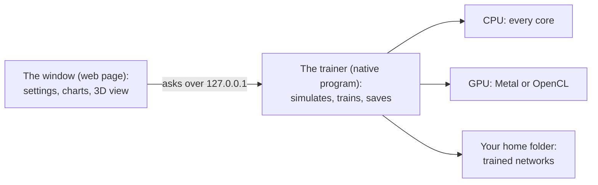

# Interacting Balls

Small neural networks learn to fly rocket-like balls in a 3D arena: to a goal, after a fleeing ball, or in team games of
tag. Nobody programs how to fly. The app breeds the brains instead, a bit like a farmer keeping the best plants: each
generation, many slightly different networks fly the same test flights, and the best ones shape the next generation.
Over hundreds of generations they learn.

It is a hobby project for learning about evolutionary algorithms. It is written in C, with Objective-C, Metal and OpenCL
for GPUs and one web page for the window.



The window only shows things. All simulation and training run natively in the trainer.

## Quick start
1. Build it (macOS, Linux or Windows, see [docs/BUILD.md](docs/BUILD.md)):
   ```bash
   cmake -S . -B build && cmake --build build -j
   ```
2. Run `build/brtrain` (`build\brtrain.exe` on Windows). It opens its window: an Edge app window on Windows, a Chrome
   app window on a Mac with Chrome, otherwise your default browser. `--no-window` starts it without a window; the
   terminal prints the address to open.
3. Press **Auto-tune for this computer**, then **Train**.
4. Watch **Validation**: the share of 64 fixed test flights the best network gets right. It never trains on them, so it
   is the honest score.
5. Press **Fly 1** or **Fly 5** to watch the current best network fly (in Swarm: **Launch**).

Closing the window does not stop training: run the program again to get the window back. The trainer quits by itself
after 2 minutes with no window open and nothing training or auto-tuning, or when you press **Quit app**.

## The three modes
- **Reach target**: fly from the pad to a goal 1.5 km away, up to a maximum you set (2–100 km).
- **Intercept**: a red runner ball, flown by a built-in guidance algorithm, launches 4–100 km out and heads for a
  defended point. Your ball must touch it (2 m) or get within the blast radius first.
- **Swarm**: 1–32 attackers fly at a defended point while 1–32 defenders try to catch them. A catch removes both balls.
  Each side is flown by the algorithm or by a network: **Nearest-K** (every ball runs its own copy of one small network
  that sees its K nearest enemies and K nearest teammates) or **Commander** (one network steers the whole side). With
  networks on both sides, the two sides train against each other.

[docs/TRAINING.md](docs/TRAINING.md) explains every setting.

## Where it runs
It runs on any CPU, and on Apple, NVIDIA, AMD and Intel GPUs. Every option flies the same simulation, compiled from one
source file (`src/sim_core.h`).

| Compute option | Hardware |
|---|---|
| CPU | Any processor, every core |
| Metal | Apple GPUs (and the AMD and Intel GPUs of Intel Macs) |
| OpenCL | NVIDIA, AMD and Intel GPUs on Windows and Linux (macOS too). The library comes with the GPU driver, so nothing extra is needed to build. |

**Automatic** (the default) picks Metal on a Mac, else the fastest-looking OpenCL GPU, else the CPU. If the GPU cannot
start or fails during training, Automatic carries on with the CPU. On a GPU, after each round of GPU work the CPU takes
over the flights still in the air whenever it would finish them sooner. Usually these are the stragglers at the end of
a batch, but a small batch can go to the CPU whole.

## Your data
Trained networks are JSON files in your home folder, one per mode: `BallArena-star-reach.json` and
`BallArena-star-tag.json` (Intercept). Swarm keeps one per side and matchup, such as
`BallArena-star-swarm-nk-K2-defend.json` or `BallArena-star-swarm-cmd-A10-D3-attack.json`.

- Each file holds the best network so far, as judged by validation. It is saved at every validation and when you pause.
- **Reset** deletes nothing. It renames the mode's file (Swarm: the matchup's AI sides) to `.bak`, replacing an older
  `.bak`, so you can undo it by renaming it back. A new network that replaces one of another shape backs up the old file
  the same way.
- Command-line runs save to the same place. When testing, set `HOME` to a scratch folder.

## Security and network notes
- The trainer listens on `127.0.0.1` only, on the first free port from 8642 to 8661. Other computers cannot reach it.
- It answers only requests addressed to `127.0.0.1` or `localhost` (this blocks DNS rebinding). A request that names
  where it comes from must come from the trainer's own page.
- Reading status is a `GET`. Every command (train, pause, reset, load, fly, quit and so on) must be a `POST` with the
  header `X-BR: 1`. A web page cannot add that header to a request to another site without the server's permission,
  which this server never gives, and cross-site requests are refused. So a web page you visit cannot control it.
- The page loads nothing from the internet (three.js is bundled, see [THIRD_PARTY.md](THIRD_PARTY.md)). It sets a strict
  Content Security Policy and cannot be framed by another page.
- Running the program again while it runs opens the running copy's window instead of starting a second one.

## License
MIT, see [LICENSE](LICENSE). three.js (MIT) is bundled in `web/vendor/`, see [THIRD_PARTY.md](THIRD_PARTY.md).

## Docs
- [docs/TRAINING.md](docs/TRAINING.md): every setting, auto-tune and tips
- [docs/ARCHITECTURE.md](docs/ARCHITECTURE.md): how the code fits together and how data flows through it
- [docs/BUILD.md](docs/BUILD.md): building on macOS, Linux and Windows; developer flags
- [docs/explainers/README.md](docs/explainers/README.md): the ideas behind the training techniques, in plain words
- [docs/memory-neurons.html](docs/memory-neurons.html) and [docs/brain-memory.html](docs/brain-memory.html): interactive
  pages on memory neurons (download and open them in a browser)
