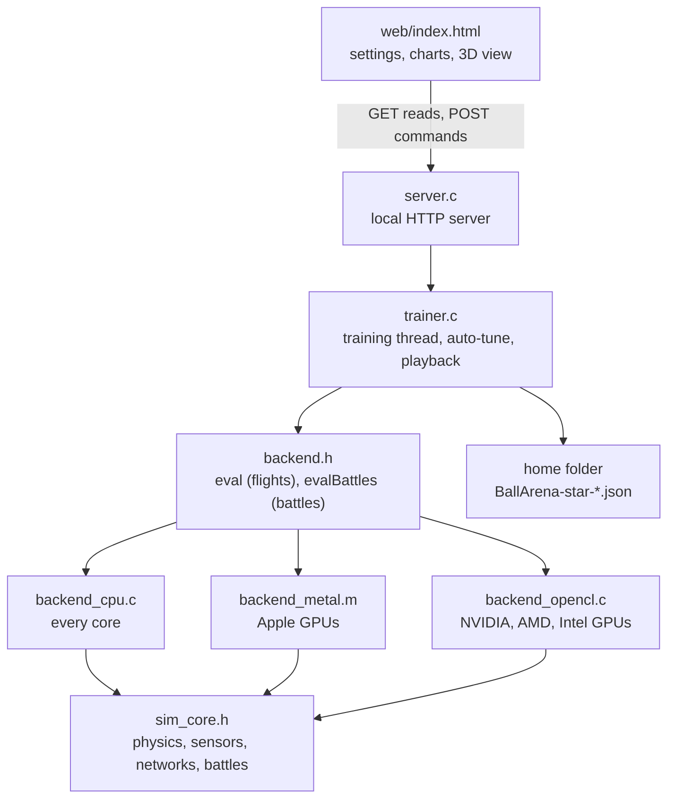

# Architecture

Think of a restaurant with a kitchen and a serving hatch. The **trainer** is the kitchen: one native program that
simulates, trains, measures and saves. The **web page** is the hatch: it takes your settings, shows charts and replays
flights in 3D, but never cooks anything itself. They talk over a small local HTTP connection on `127.0.0.1`.

The simulation is written once, in `sim_core.h`, and compiled three ways: as C for the CPU, and as Metal and OpenCL C
for GPUs. So every compute option flies the same physics and the same networks.

## Files

| File | Role |
|---|---|
| `src/main.c` | Entry point. Developer flags go to the command line (`cli_main`); otherwise it starts the server and opens the window (`--no-window`: no window). |
| `src/server.c` | Local HTTP server on 127.0.0.1: the page, three.js and a small JSON API. Checks every request, opens the app window, quits when idle. |
| `src/trainer.c`, `src/trainer.h` | The training service: settings, scenarios, optimizers, training techniques, validation, saving, auto-tune, flight and battle playback, and the developer command line. |
| `src/sim_core.h` | The simulation: physics, the 29 sensors, past frames and memory, the network, the guidance algorithm, swarm battles. Compiles as C, Metal and OpenCL C. |
| `src/backend.h` | The backend interface (`eval`, `evalBattles`) and helpers the GPU hosts share, including the CPU tail (`BrTail`). |
| `src/backend_cpu.c` | CPU backend: every core flies whole flights or battles. Also the CPU tail for the GPUs and `br_cpu_fits`, which refuses a network too big for the CPU's fixed buffers. |
| `src/backend_metal.m` | Metal host (Apple GPUs, and the AMD and Intel GPUs of Intel Macs). |
| `src/backend_opencl.c`, `src/br_cl.h` | OpenCL host. The library is loaded from the GPU driver at run time, so no SDK is needed. |
| `src/kernels/metal_kernel.metal`, `src/kernels/opencl_kernel.cl` | Thin GPU kernels around `sim_core.h`: `br_kernel` (a thread per flight), `br_sw_kernel` (a thread per battle), `br_sw_group_kernel` (a work-group per battle). |
| `src/threads.h` | Portable threads, locks, atomics and timing (pthreads, or Win32 threads on Windows). |
| `web/index.html` | The interface. It displays only and never simulates. |
| `web/vendor/` | three.js and the few addons the 3D view uses. |
| `cmake/embed.cmake` | Turns the simulation source, kernels, page and three.js into C strings, so `brtrain` is one self-contained file. |

## Data flow
One generation in Reach or Intercept:

1. The page sends its settings with `POST /api/start`. The training thread takes them before the next generation.
2. **Automatic difficulty** turns them into this level's settings (`curriculum`; level 10 leaves them unchanged).
3. Scenarios are built on the CPU. They are kept for a few generations and rebuilt when the settings change.
4. Each island's optimizer proposes networks (`cma_ask`, or the genetic algorithm).
5. **Sensor normalisation** is folded into each network's first layer (`norm_fold`).
6. The backend flies every network on every scenario (`eval`) and returns 5 numbers per flight.
7. Scores (`fitness`) go back to the optimizers. The best network of the generation is the **star**.
8. Every 10 generations: validation, the kept network, the difficulty check, the restart check, then the save.

In short: settings → `curriculum` → scenarios → `cma_ask` → `norm_fold` → backend `eval` → `fitness` → `cma_tell` →
every 10 generations `validate` → keep → save. Swarm follows the same rhythm with battles (`sw_generation`).

The page polls `GET /api/status` about three times a second. All routes:

| Route | Method | What it does |
|---|---|---|
| `/api/status` | GET | Generation, scores, speed, messages, the settings in use, and chart points since a given generation. |
| `/api/hardware` | GET | The compute options on this computer and what Automatic picks. |
| `/api/star` | GET | The kept network as JSON (Save network…). |
| `/api/autotune/status` | GET | Auto-tune progress and result. |
| `/api/start`, `/api/pause`, `/api/reset` | POST | Train (or apply new settings while training), pause, reset. |
| `/api/load` | POST | Load a network file (Reach and Intercept). |
| `/api/mode` | POST | Switch mode: save this mode's network and load the other's. |
| `/api/autotune` | POST | Start auto-tune. |
| `/api/fly` | POST | Fly the star a few times and return the sampled paths. |
| `/api/battle` | POST | Fly one swarm battle and return every ball's path, catch and leak. |
| `/api/quit` | POST | Stop the app. |

Commands must carry the header `X-BR: 1` (see the security notes in the
[README](../README.md#security-and-network-notes)). They run one at a time; reads run alongside them, so a long pause
does not freeze the page.

## The simulation
- **Physics.** A 105 kg ball with an engine of thrust-to-weight × its weight. Drag rises through the sound barrier
  (the drag coefficient peaks at about twice its subsonic value near Mach 1.15, then eases off), plus lift, weathercock
  torque and air that thins with height. It steers with a gimbal, fins and small thrusters, whose authority grows with
  thrust and airspeed. For its first 4 s after launch it cannot sink below the pad. A flight ends on a hit, when it hits
  the ground, or at the time limit: the larger of 120 s and distance ÷ 150 m/s + 60 s.
- **Sensors.** 29 numbers per decision, seen from the ball: where the target is and how it moves, the ball's own speed,
  spin, tilt and height, and guidance cues (closing speed, how fast the line of sight turns, time to go, the predicted
  miss).
- **Network.** Fully connected layers with tanh. Inputs: the sensors now, K past frames, and memory (the last hidden
  layer from the previous decision). Outputs: throttle, pitch, yaw. It decides every second physics step by default.
- **Guidance algorithm** (`br_algo_control`). The hand-written pilot: climb out, cruise toward far fixed goals, then
  zero-effort-miss guidance (steer to cancel the miss predicted if nobody steered). It flies the runner and every
  algorithm side, and it is what the head start copies.

**Reach.** The ball starts 10 m above the pad, pointing straight up. Goals are 1.5 km to the maximum away, with up to
15 m/s of wind. A hit is within 30 m.

**Intercept.** Each scenario first flies the runner on the CPU (the algorithm, its own thrust, an optional weave) and
records its path: position and velocity after every physics step. All of a generation's paths go into one buffer that
every backend uploads, so every network in a batch chases exactly the same runner. Each scenario stores where its path
starts in that buffer (`br_traj_off`) and how long it is. The chaser's sensors see the runner `delay` steps late, plus
noise from a stateless hash, so the CPU and GPUs draw the same noise. A tag means the centres come within max(2 m, blast
radius) at any moment of a step: the test is swept, so fast passes cannot slip through. Once the chaser has closed in
(within 3 km), the moment the gap starts to widen it has passed, and the flight ends. Layout: the defended point is
0–3 km from the origin; the runner launches at the set range from it, or up to 1.5 km further; the chaser 0.5–3 km from
it and at least 0.7 × range from the runner's site. Every setup is kept. Runner paths are flown on all cores, each from
its own random generator, so they do not depend on the thread count.

**Results** per flight (`BR_OUT` = 5): closest approach, hit, flight time, physics steps, and the share of mid-flight
spent below 5 m.

## Swarm battles
A battle is one block of floats: a header (step, catches, leaks, done, ball-steps), then 40 floats per ball (`SW_B`: the
flight state plus target, weave, launched, fate, start-of-step position and nearest attacker). Attackers come first,
then defenders. Start positions are made on the CPU (`sw_gen_scen`) and uploaded, so every backend starts from identical
states: attackers on the ground between the minimum and maximum launch range, from any direction; defenders 0.5–3 km
from the defended point.

Each step runs in four phases:
1. **Decide** (on decision steps). Defenders pick targets in index order: the nearest live attacker nobody has claimed
   yet, else the nearest one. A commander side runs one network pass for the whole side. Other balls run their nearest-K
   network (29 own-target sensors, plus 7 numbers for each of the K nearest enemies and K nearest teammates) or the
   algorithm.
2. **Move.** The same physics as flights; attackers use the attacker thrust.
3. **Scan.** Each defender finds its nearest live attacker during the step (swept).
4. **Resolve** (one thread). Catches in defender order (within the catch distance: both balls removed), leaks (an
   attacker within 30 m of the defended point), crashes, radar launches for the next step, and the end of the battle.

A defender on its pad launches one step after its radar sees an attacker, because radar is checked after every ball has
moved. Swarm networks have no past frames, memory or sensor delay: each ball already sees its neighbours, or the whole
battle, every step.

Three shortcuts keep battles fast without changing results. A battle ends at once when every defender is gone and the
attackers fly the algorithm without weaving: unopposed, they arrive, so they count as leaks (`--no-early` turns this
off). The catch search skips attackers that cannot beat the nearest one so far (an exact bound). And on the CPU, a
nearest-K side decides as one batch, reading each layer's weights once for all its balls.

**Results** per battle (`BR_SWOUT` = 8): catches, leaks, each side's closeness score, ball-steps, battle time, and
crashed attackers and defenders. The GPUs match the CPU on every battle with algorithm or random brains, and on about
99% with trained brains: tiny float differences can flip a rare borderline catch. `--compare --mode swarm` checks this,
with the CPU tail off so the GPU flies every battle to the end.

## GPU layouts
A GPU is a stadium full of simple workers that are fast only when they all do the same job. The layouts keep them busy.

- **Flights.** One GPU thread per flight. A **dispatch** (one call to the GPU) moves every live flight `chunk` physics
  steps. Each call starts at 64 steps and adapts toward the target time per dispatch (40 ms by default; auto-tune tries
  20, 40 and 80): at most 4× longer or shorter each time, between 4 and 100,000 steps. Short dispatches keep the
  computer responsive and stay far below the driver's watchdog (about 2 s on Windows).
- **Compaction.** Once 30% of the dispatched flights have ended, the list of live ones is packed, so the groups of
  threads that run in lockstep stay full.
- **CPU tail.** Near the end of a batch only a few flights still run, but a dispatch costs about the same however few
  threads it has. After each dispatch the backend asks: would the CPU move the rest faster than the GPU just did? The
  CPU's speed is measured once per network shape (a few steps flown on a copy of the first item) and refined by every
  tail it flies. Before that, the CPU takes over only when each remaining item gets its own core. A cap bounds the
  hand-off: the larger of 2,048 and compute units × 128 on OpenCL; 2,048 on Metal, which does not report its core count.
  A batch within the cap can go to the CPU whole right after its first dispatch. A shape too big for the CPU is never
  handed off. `--compare` turns the tail off, so it checks what the GPU flies.
- **Battles.** Small swarms get one thread per battle (`br_sw_kernel`). From 12 balls, Automatic gives each battle a
  work-group with a thread per ball (`br_sw_group_kernel`): balls rounded up to 32 threads, at most 64, looping when
  there are more balls. The battle lives in fast on-chip memory, with barriers between phases; a battle too big for that
  memory keeps a thread per battle. A commander's layers are split across the threads, whole neurons per thread in the
  same order, so results do not change. Auto-tune measures both layouts and can pin one.
- **Weights.** GPUs read each layer as stored, row by row. The CPU first transposes it so its inner loop runs across
  neurons and vectorises. The CPU uses a fast tanh (error about 1e-4); GPUs use their own.
- **Hosts.** Kernels are compiled at run time, sized for the current layer widths. Metal uses shared memory on Apple
  GPUs and a copy on each side for GPUs with their own memory. Both hosts check every GPU call: a failure prints why and
  returns an error, and Automatic then carries on with the CPU.

## Training techniques
The [explainers](explainers/README.md) tell the same story in plain words, with pictures. Each title below links to its
page. The techniques are on by default unless noted.

**[Optimizers](explainers/evolution-strategies.md).** Reach and Intercept run one optimizer per island: CMA-ES or the
genetic algorithm. Swarm runs one CMA-ES per AI side. CMA-ES (Covariance Matrix Adaptation Evolution Strategy) samples
networks around a centre and learns which directions and step sizes pay off. Up to 2,000 weights it is **sep-CMA-ES**,
which learns one step size per weight. Above that it is **LM-MA-ES**, which keeps a few memory vectors (4 + ⌊3 ln n⌋ for
n weights) of the main search directions, at a cost that grows roughly in step with n. Both use **[mirrored
sampling](explainers/evolution-strategies.md#mirrored-pairs)**: every random step z is tried as a pair, z and −z, and
only the better of each pair counts. This stops noisy scores from shrinking the step size. Code: `cma_init`, `cma_ask`,
`cma_tell`.

**[Restarts](explainers/training-techniques.md#restarts-when-stuck)** (BIPOP-style: a big population and a small one
take turns). When neither validation nor the average star score improves for 6 validation checks, and validation is
below 100%, the optimizer restarts around the kept network. Odd restarts search wide: population ×2, then ×4, then at
most ×8, with step size 0.1. Even restarts search fine: half the population, step size 0.01. Reach and Intercept restart
only with CMA-ES. Swarm restarts each side on its own (population at most 4,096).

**[Sensor normalisation](explainers/training-techniques.md#sensor-normalisation)** (Reach and Intercept). The optimizer
searches networks that see standardised sensors: each sensor minus its mean, divided by its spread. Before a network
flies, `norm_fold` folds that into its first layer, so the simulation, every backend and the saved file see an ordinary
network. The statistics come from flying the star on the CPU over up to 16 of the generation's scenarios: at generation
5 (or after the first generation, for an existing network), then every 50. Each update blends half-way with the old
statistics and re-expresses the optimizer's networks so they still fly the same (`norm_update`).

**[Head start](explainers/training-techniques.md#head-start-by-imitation)** (behaviour cloning with DAgger). A network
that would start from random weights first learns to copy the guidance algorithm. The algorithm flies 64 scenarios
(Swarm: 48 battles) while every decision is recorded as "what the network would sense, what the algorithm did": up to
60,000 decisions (15,000 for a commander). The network is fitted to them by gradient descent (Adam, mean squared error,
batches of 128) for up to 3 s per round. There are 3 rounds. In rounds 2 and 3 the network flies and the algorithm still
says what it would do (DAgger), so the copy also learns to recover from its own mistakes. Evolution then starts from the
copy with a small CMA-ES step size: 0.02, or 0.05 in Swarm. Code: `bc_flights`, `bc_battles`, `bc_fit`.

**[Automatic difficulty](explainers/training-techniques.md#automatic-difficulty)** (a curriculum; off by default).
`curriculum` turns the settings and a level from 0 to 10 into the settings training uses; level 10 is the settings
themselves. Lower levels slide toward an easy version: goals up to 3 km, runners or attackers from 4 km (Swarm: up to
6 km), and no noise or delay. A network that chases (Intercept, or AI defenders against algorithm attackers) also gets
no weaving, a runner thrust-to-weight of at most 1.5, a radar that sees just past the farthest start (unless it is off),
a catch radius of at least 10 m and, in Swarm, fewer attackers. AI attackers against algorithm defenders get fewer
defenders that launch later (a 2 km radar). AI vs AI shares only the common knobs. The network's shape never changes;
ball counts change only when no commander depends on them. Training moves up a level after two validations in a row at
the threshold (`curriculum_check`); in Swarm, every AI side must reach it. A new network starts at level 0 and a saved
one resumes its saved level.

**[Prioritised fictitious self-play](explainers/training-techniques.md#self-play-opponents)** (Swarm, AI vs AI). Each
side keeps a pool of its last 16 stars, adding one every 5 generations in place of the oldest. Each scenario gets one
opponent from the other side's pool, drawn more often the more this side still loses to it. The success rate (the share
of attackers caught, or leaked) is updated after every generation and starts at 50% for a new pool member. Every
candidate meets the same opponent on the same scenario, so their scores stay comparable. AI against the algorithm simply
trains against the algorithm.

**[The kept network](explainers/training-techniques.md#keeping-the-best-network)** (a hall of fame). The star changes
every generation. At each validation it is offered to the hall of fame (`hof_offer`; Swarm: per side in `sw_validate`).
It replaces the kept network unless that one, of the same shape, validates better on the same settings; after a settings
change the kept one is validated again first. The kept network is what is saved, what restarts start from and what Save
network… downloads.

## Validation and saving
Validation flies the star on a fixed set of 64 scenarios or battles (seed 4242) every 10 generations. In Swarm each AI
side flies against the algorithm: defenders report their catch rate, attackers their leak rate. The set is rebuilt when
settings that shape the scenarios change. With automatic difficulty below level 10, validation uses that level's
settings, so its set is rebuilt at each step up and the score dips; the status line shows the level.

Each file stores the kept network, its layer sizes, the physics it trained with (physics step, decision rate,
thrust-to-weight; Swarm also the attacker thrust), and its generation, fitness, validation and level. Replays always use
the stored physics. Before a file is overwritten by a network of another shape, or on Reset, it is renamed to `.bak`.
Reach also reads the older names `BallArena-star.json` and `BallisticRange-champion.json` when there is no reach file.
Loading accepts Reach and Intercept files of the current mode with up to 8 hidden layers of equal width (up to 128), K
up to 4 and 3 outputs.

## Playback
`/api/fly` flies the star natively with its own training physics, about 20 samples per second. In Reach each press
launches from a new spot up to 15 km away (the network only sees the goal relative to itself). In Intercept it also
returns the runner's path, sampled at the same steps, and the radar range. `/api/battle` takes its physics from the
defenders' saved star (else the attackers', else the panel). Each AI side flies its training star when it matches the
settings, else its saved one.

The maths

**Folding the standardisation into layer 1.** With sensor means $\mu_i$ and spreads $\sigma_i$, a first-layer weight
$W_{ji}$ and bias $b_j$ become

$$
W'_{ji} = \frac{W_{ji}}{\sigma_i}
\qquad
b'_j = b_j - \sum_i \frac{W_{ji}\,\mu_i}{\sigma_i}
$$

so $W'x + b' = W\,\frac{x - \mu}{\sigma} + b$. Only the sensors and past frames are scaled; memory inputs are left
alone. Spreads are floored at 0.05.

**Dispatch length.** With target time $T$ and the last dispatch taking $t$ ms for $c$ steps:

$$
c_{\text{next}} = \min\left(100000, \max\left(4, c \cdot \min\left(4, \max\left(\tfrac{1}{4}, \tfrac{T}{\max(t, 0.5)}\right)\right)\right)\right)
$$

**CPU tail.** With $n$ items still live out of $a$ dispatched, CPU time per step per thread $m_{\text{cpu}}$ and $h$ CPU
threads, the CPU takes over when

$$
m_{\text{cpu}} \cdot \max\left(1, \frac{n}{h}\right) < \frac{t}{c} \cdot \frac{n}{a}
$$

The right side assumes the GPU's time shrinks with the number of live threads, which favours the GPU.

