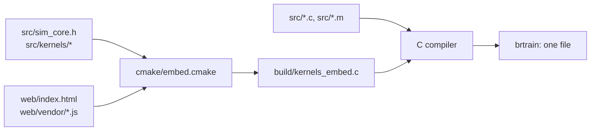

# Build

`brtrain` is one self-contained program, a bit like a ship in a bottle: everything it needs at run time is packed inside
it when it is built. That includes the web page, three.js and the simulation source the GPU driver compiles. CMake does
the packing and the compiling. No prebuilt executables are published: build from source.



The GPU code is compiled later, by the GPU driver, the first time a GPU option runs. It is sized to fit the network.

## What you need
- CMake 3.16 or newer and a C11 compiler: Clang, GCC or MinGW-w64.
- macOS: the Xcode Command Line Tools (for Clang and Metal).
- Nothing for OpenCL. The library comes with the GPU driver and is loaded when the program runs.

The build type defaults to Release.

## macOS (CPU, Metal and OpenCL)
```bash
cmake -S . -B build && cmake --build build -j
```

For a universal program that runs on both Apple silicon and Intel Macs:
```bash
cmake -S . -B build-universal "-DCMAKE_OSX_ARCHITECTURES=arm64;x86_64" && cmake --build build-universal -j
```

**App bundle.** Put `build/brtrain` in `Ball Arena Trainer.app/Contents/MacOS/` and this `Info.plist` in
`Ball Arena Trainer.app/Contents/`. `CFBundleExecutable` must name `brtrain`, or macOS looks for a program named after
the bundle. `LSUIElement` keeps it out of the Dock, since its window is a browser window.

```xml
<?xml version="1.0" encoding="UTF-8"?>
<!DOCTYPE plist PUBLIC "-//Apple//DTD PLIST 1.0//EN" "http://www.apple.com/DTDs/PropertyList-1.0.dtd">
<plist version="1.0">
<dict>
  <key>CFBundleExecutable</key><string>brtrain</string>
  <key>CFBundleIdentifier</key><string>org.example.ball-arena-trainer</string>
  <key>CFBundleName</key><string>Ball Arena Trainer</string>
  <key>CFBundlePackageType</key><string>APPL</string>
  <key>LSUIElement</key><true/>
</dict>
</plist>
```

macOS runs one copy of an app at a time, so opening the app again while it runs does not bring a closed window back.
Open its address instead (normally http://127.0.0.1:8642/), or run `open -n "Ball Arena Trainer.app"`: the new copy
finds the running one, opens its window and quits.

## Linux (CPU and OpenCL)
```bash
sudo apt install build-essential cmake   # Debian and Ubuntu; use your distribution's packages elsewhere
cmake -S . -B build && cmake --build build -j
```
GPUs need their vendor's driver with OpenCL support (`libOpenCL.so.1`). The window opens in your default browser.

## Windows (CPU and OpenCL)
Natively, with MinGW-w64 GCC (for example from MSYS2) and Ninja:
```bash
cmake -S . -B build -G Ninja -DCMAKE_C_COMPILER=gcc && cmake --build build
```

Or cross-compiled from macOS or Linux with MinGW-w64:
```bash
cmake -S . -B build-win -DCMAKE_SYSTEM_NAME=Windows -DCMAKE_C_COMPILER=x86_64-w64-mingw32-gcc -DBR_ARCH=x86-64-v3
cmake --build build-win -j
```

A MinGW build links its runtime statically, so `brtrain.exe` needs no MinGW DLLs: only Windows' own (`KERNEL32`,
`SHELL32`, `WS2_32` and the C runtime). OpenCL comes from the GPU driver. The window opens as an Edge app window, else
in your default browser.

## Building for other computers
By default the CPU code is tuned to the processor of the computer that builds it (`-march=native`, or `-mcpu=native` on
Arm; with Visual Studio's compiler, AVX2 when the processor has it). Such a program can stop with "illegal instruction"
on an older processor. For a program meant for other computers, set one of these options with `-D` (for example
`-DBR_PORTABLE=ON`):

| Option | Default | What it does |
|---|---|---|
| `BR_PORTABLE` | off | Builds for the compiler's baseline: any processor of the same architecture. |
| `BR_ARCH` | empty | Builds for a chosen level: `x86-64-v2`, `x86-64-v3` (AVX2) and so on with GCC or Clang, `AVX2` with Visual Studio's compiler. |

Cross builds and universal macOS builds are never tuned to the build machine. CMake prints its choice, for example
`brtrain: CPU code for any arm64 processor`.

The other options:

| Option | Default | What it does |
|---|---|---|
| `BR_METAL` | on for Apple | The Metal backend. |
| `BR_OPENCL` | on | The OpenCL backend, loaded from the GPU driver at run time. |

## Developer command line
Started without flags, `brtrain` opens the app. With `--bench`, `--compare`, `--train`, `--list-devices`, `--ceiling` or
`--help`, it runs in the terminal and exits. `--help` lists every flag.

Test runs save networks to your home folder, just like the app. Point `HOME` at a scratch folder so they cannot touch
your own networks:

```bash
HOME=$(mktemp -d) build/brtrain --train --mode tag --atk-range 25000 --blast 5 --detect 20000 --gens 500
HOME=$(mktemp -d) build/brtrain --train --mode swarm --attackers 4 --defenders 4 --att algo --def ai --k 2 --gens 300
HOME=$(mktemp -d) build/brtrain --compare --mode swarm --attackers 16 --defenders 16
```

**Commands**

| Flag | What it does |
|---|---|
| `--train [--gens N]` | Trains through the same service the app uses, for N generations (default 100), printing a line per generation (with a diversity option on, also its state after each validation). |
| `--bench` | Times one batch (`--pop` networks × `--scen` scenarios) on the CPU, Metal and OpenCL device 0. Swarm: 1,024 battles on every option and GPU layout. |
| `--compare` | Like `--bench`, and counts how many results match the CPU's. Here the GPUs fly every flight or battle to the end, without the [CPU tail](ARCHITECTURE.md#gpu-layouts). |
| `--ceiling` | Intercept: how often the guidance algorithm, with perfect sensors, tags the runner on these settings (400 setups). With `--mode swarm`: 400 algorithm vs algorithm battles. |
| `--list-devices` | Lists the OpenCL devices and the compute options. |
| `--help` | Lists every flag. |
| `--no-window` | Starts the app without opening its window. |

**Compute**

| Flag | What it does |
|---|---|
| `--backend auto\|cpu\|metal\|opencl:N` | The compute option. |
| `--threads N` | CPU threads (0 = all). |
| `--wg N` | GPU work-group size. |

**Network and training**

| Flag | What it does |
|---|---|
| `--mode reach\|tag\|intercept\|swarm` | The mode (`tag` and `intercept` are the same). |
| `--pop N`, `--scen N` | Population; scenarios per network (1–256). |
| `--layers N`, `--width N` | Hidden layers (1–8); neurons per layer (4–128). |
| `--K N`, `--mem 0\|1` | Past frames (0–4); memory neurons. |
| `--opt cma\|sep\|lm\|ga` | CMA-ES with the automatic variant, sep-CMA-ES, LM-MA-ES, or the genetic algorithm. |
| `--islands N` | Turns islands on, with N of them. |
| `--dt S`, `--tw X`, `--every-step` | Physics step in seconds; thrust-to-weight; decide every physics step. |
| `--alt-reward` | Reward staying above 5 m. |
| `--load FILE` | Starts from a saved Reach or Intercept network (it must match `--mode`). |
| `--seed N` | Training's random seed. With `--backend cpu --no-imitate`, a run repeats exactly. |

**Techniques**

| Flag | What it does |
|---|---|
| `--no-imitate` | No head start. |
| `--auto-diff` | Automatic difficulty (steps up at 80%). |
| `--no-restarts`, `--no-norm` | No restarts; no sensor normalisation. |
| `--val-every N` | Validate every N generations (default 10). |

**Diversity search** (all off by default; see [diversity search](explainers/diversity.md))

| Flag | What it does |
|---|---|
| `--novelty`, `--novelty-w X` | Novelty bonus: rank by score + X × novelty of behaviour (X = 0–5, default 0.5). |
| `--nsr` | Novelty islands: with `--islands N`, every other island ranks by score and novelty (Reach, Intercept). |
| `--map-elites` | Behaviour map searched by CMA-ME improvement ranking (Reach, Intercept). |
| `--exploiters` | Swarm, AI vs AI: each side trains an exploiter of the other side's current star. |

**Reach, Intercept and Swarm settings**

| Flag | What it does |
|---|---|
| `--reach-max M` | Reach: goals 1.5 km to M metres away (2,000–100,000). |
| `--atk-range M` | Runner launch distance (4,000–100,000 m). Swarm: the attackers' minimum. |
| `--atk-range-max M` | Swarm: the attackers' maximum launch distance. |
| `--evade X` | Runner (Swarm: algorithm attacker) weaving, 0–1. |
| `--tw-runner X` | Runner (Swarm: attacker) thrust-to-weight. |
| `--noise M`, `--delay MS` | Sensor noise σ in metres; sensor delay in milliseconds (Intercept only). |
| `--detect M` | Radar range (0 = launch at once). |
| `--blast M` | Catch radius, 0–10 m. |
| `--attackers N`, `--defenders M` | Swarm ball counts (1–32). |
| `--att ai\|algo`, `--def ai\|algo` | Who flies each side. |
| `--att-brain nk\|cmd`, `--def-brain nk\|cmd` | Nearest-K or commander. |
| `--k K` | Nearest-K: K nearest enemies and teammates (1–8). |
| `--no-early` | Never end a battle early. |
