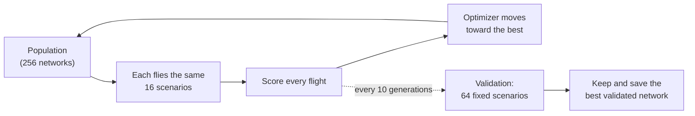

# Training

Training works like a coach running tryouts. Every generation, a few hundred slightly different networks run the same
drills: the scenarios, such as "fly to a goal 4 km north-east in a 10 m/s wind". Each flight gets a score. The optimizer
then shifts its next batch of networks toward what the best ones did, and tries new variations around them. Every
10 generations the best network sits an exam it has never seen. That is **Validation**, the number to watch.

The best network of each generation is the **star**: Fly 1 and Fly 5 replay it. The best *validated* network is the one
that is kept and saved; a drop in validation never replaces it.

## Quick recipe
1. Press **Auto-tune for this computer**, then **Train**.
2. Leave **Head start** on: a new network first copies the built-in guidance algorithm, so it flies from the start.
3. Watch Validation. When it stops rising, make the task harder (or turn on **Automatic difficulty** and let it climb).

## Auto-tune
Auto-tune times every compute option on this computer and applies the fastest setup.

- **Reach and Intercept.** Without a trained network of the current shape, it first trains one for a few seconds on the
  CPU, because random networks crash at once and would make the timing meaningless. Then, for each option, it tries GPU
  work-group sizes (32–512) and dispatch lengths (20, 40 and 80 ms), and grows the batch until speed stops improving.
  The winner runs the most **generations per second** at a useful population: 512 networks for CMA-ES, 256 for the
  genetic algorithm. A bigger population improves each generation only a little but makes it slower. Spare capacity (a
  bigger batch costing at most 25% more time) goes into more islands of about 48 networks (CMA-ES) or 32 (genetic) when
  islands are on, or more scenarios per network when they are off. In Intercept, the CPU time to build the scenarios
  (flying every runner) counts in every timing.
- **Swarm.** It flies one generation of battles with your matchup on every option, including both GPU layouts (a thread
  per battle, or a work-group per battle). It uses your saved networks with small variations when they fit, else random
  ones. It sets the compute option, work-group size and layout, and leaves population and battles alone.

## Settings
The **Modes** column says where a setting does something. The panel hides or greys out the rest. Command-line flags are
in brackets; see [BUILD.md](BUILD.md#developer-command-line).

**Mode**

| Setting | Default | Modes | What it does |
|---|---|---|---|
| Mode | Reach target | all | Reach target, Intercept or Swarm. Reach and Intercept each keep one network; Swarm keeps one per side and matchup (`--mode reach\|tag\|swarm`). |
| Max goal distance | 7 km | Reach | Goals are 1.5 km to this far (2–100 km). The time limit grows with it. Raise it in steps (`--reach-max`). |
| Attackers / Defenders | Algorithm / AI | Swarm | Who flies each side: the guidance algorithm or a network. AI vs AI trains both sides together; Algorithm vs Algorithm only shows battles (`--att`, `--def`). |
| Brain | Nearest-K | Swarm | Nearest-K: every ball runs its own copy of one small network, at any swarm size. Commander: one network sees every ball and steers its whole side; each attacker/defender count trains its own (`--att-brain`, `--def-brain`). |
| Number of attackers, defenders | 4, 4 | Swarm | 1–32 each (`--attackers`, `--defenders`). |
| Nearest-K sees | 2 + 2 | Swarm | K = 1–8 nearest enemies and K nearest teammates. More context, more weights (`--k`). |
| Save network…, Load network… | — | Reach, Intercept | Download the kept network as a JSON file, or start from one saved in this mode (`--load`). Swarm saves each side automatically and has no Save or Load. |

**Intercept** (called **Engagement** in Swarm)

| Setting | Default | Modes | What it does |
|---|---|---|---|
| Blast radius | off (touch) | Intercept, Swarm | 0–10 m. Off: the balls must touch (2 m). On: getting this close counts as a catch, like a proximity fuse (`--blast`). |
| Runner launch range (Swarm: attackers launch from) | 7 km | Intercept, Swarm | 4–100 km. Intercept: the runner launches this far, plus up to 1.5 km, from the defended point (`--atk-range`). |
| Attackers launch up to | 8.5 km | Swarm | Attackers launch anywhere between the two distances, from any direction (`--atk-range-max`). |
| Runner (attacker) weaving | off | Intercept, Swarm | 0–1: sine weaves on its steering after 6 s. In Swarm only algorithm attackers weave (`--evade`). |
| Runner (attacker) thrust-to-weight | 2.5× | Intercept, Swarm | 1.2–5: the runner's or the attackers' engine (`--tw-runner`). |
| Sensor noise | off | Intercept, Swarm | σ = 0–50 m (command line: up to 200). Uniform noise on every sensed position, up to 1.7 σ either way, and half that on velocity (`--noise`). |
| Sensor delay | off | Intercept | 0–400 ms (command line: up to 2,000). Your ball senses the runner as it was this long ago. Swarm has no delay (`--delay`). |
| Radar range | off | Intercept, Swarm | 0–100 km. Your ball (Swarm: each defender) waits on its pad until the radar sees the runner (an attacker) this close. Off: it launches at once. Short ranges make many setups impossible: check with `--ceiling` (`--detect`). |

**Compute, Network, Training**

| Setting | Default | Modes | What it does |
|---|---|---|---|
| Compute option | Automatic | all | Automatic, CPU, Metal or an OpenCL GPU. Automatic falls back to the CPU if the GPU fails (`--backend`). |
| Hidden layers | 1 | all | 1–8 (`--layers`). |
| Neurons per layer | 32 | all | 8–128 in steps of 8 (command line: 4–128) (`--width`). |
| [Past frames](explainers/memory-neurons.md) | off | Reach, Intercept | K = 0–4 earlier sensor readings as extra inputs (`--K`). |
| [Memory neurons](explainers/memory-neurons.md) | off | Reach, Intercept | The last hidden layer feeds back into the next decision (`--mem 1`). |
| [CMA-ES / Genetic](explainers/evolution-strategies.md) | CMA-ES | Reach, Intercept | CMA-ES samples networks around a centre and learns how far to step in each direction. The genetic algorithm mixes and mutates the best networks, and needs decay to fine-tune (`--opt ga`). Swarm always uses CMA-ES. |
| Population | 256 | all | 16–16,384 networks per generation (command line: 8–262,144). Swarm splits it between its AI sides, at least 8 each (`--pop`). |
| Scenarios (Swarm: battles) per network | 16 | all | 1–256. More gives steadier scores and slower generations (`--scen`). |
| New scenarios every | 5 generations | all | 1–50. Networks are compared on the same tests for this long. |
| Use islands | off | Reach, Intercept | Separate populations (2–256, default 8) side by side; every 10 generations (1–50) each passes its best to the next in a ring (`--islands N`). |
| [Decay step size](explainers/step-size.md) | on: ×0.995, minimum 1e-4 | all | Shrinks the search step every generation, down to the minimum (decay 0.900–0.999, minimum 1e-6 to 0.1). |
| Reward staying above 5 m | off | Reach, Intercept | Up to +0.5 for flying above 5 m in mid-flight (from 3 s after launch until 300 m from the target): nothing at half the time, full at 80%. Stops ground skimming (`--alt-reward`). |
| Reward speed | off, weight 3 | Reach, Intercept | A hit scores up to the weight (0.5–10) more the sooner it lands. Off: each second of flight costs 0.01. |

**Techniques** (explained in plain words in [training techniques](explainers/training-techniques.md))

| Setting | Default | Modes | What it does |
|---|---|---|---|
| [Head start](explainers/training-techniques.md#head-start-by-imitation) | on | all | A new network first copies the guidance algorithm (behaviour cloning, 3 DAgger rounds), then evolves (`--no-imitate` turns it off). |
| [Automatic difficulty](explainers/training-techniques.md#automatic-difficulty) | off | all | A new network starts at level 0, an easy version of your settings, and climbs a level (of 10) each time validation reaches **Step up at validation** (30–100%, default 80%) twice in a row. Level 10 is your settings. Validation is measured at the current level, so it dips after each step up (`--auto-diff`, always 80%). |
| [Restart when stuck](explainers/training-techniques.md#restarts-when-stuck) | on | all; Reach and Intercept only with CMA-ES | After 6 validation checks with no progress, restart around the kept network, alternating a wide search with a bigger population and a fine one with a smaller population (`--no-restarts`). |
| [Normalise sensors](explainers/training-techniques.md#sensor-normalisation) | on | Reach, Intercept | Rescales each sensor by its running mean and spread. Folded into the first layer, so saved networks are ordinary ones (`--no-norm`). |
| [CMA-ES variant](explainers/evolution-strategies.md) | Automatic | every CMA-ES run, Swarm too | sep-CMA-ES learns one step size per weight. LM-MA-ES, for big networks, learns a few main search directions. Automatic: sep-CMA-ES up to 2,000 weights, LM-MA-ES above. Both try candidates in mirrored pairs (`--opt sep`, `--opt lm`). |

**Physics**

| Setting | Default | Modes | What it does |
|---|---|---|---|
| Physics step | 20 ms | all | 5–40 ms. Smaller is finer control and slower training (`--dt`, in seconds). |
| Brain decides every physics step | off | all | Off: it decides every second step (`--every-step`). |
| Thrust-to-weight (Swarm: defenders) | 2.5× | all | 1.2–20. High thrust needs a small physics step (5 ms) to learn well (`--tw`). |

Validation runs every 10 generations (`--val-every`) on 64 fixed scenarios or battles. Changing the network shape starts
a new network; the saved one is kept as a `.bak` file.

## Reading the numbers
- **Best fitness**: the star's average score this generation. **Star hits**: its hit rate on this generation's
  scenarios. Both are often lucky, because the best of hundreds is chosen on them. In Swarm, Star hits becomes **Caught,
  leaked**: the shares of attackers caught and leaked in the best networks' battles.
- **Validation**: the star's hit rate on the fixed set. In Swarm, each AI side flies against the algorithm: defenders
  show their catch rate, attackers their leak rate.
- **Step size**: how far the optimizer is searching. It shrinks as training settles.
- The status line shows the compute option, messages, the number of islands, the difficulty level and restarts.

## Tips
- Watch Validation, not Star hits.
- Keep the head start on for new networks. With automatic difficulty, set your real target and let it climb. Validation
  is measured at the current level, so expect a dip after each step up.
- Decay ×0.995 with a 1e-4 minimum works well. ×0.9 freezes training within about 60 generations.
- Turn on the speed reward only once the ball hits reliably; too early, it rushes and misses.
- Replays always fly the star with the physics it trained with (physics step, thrust-to-weight, decision rate), whatever
  the panel says. Training uses the panel's physics: change them and the star relearns.
- Intercept: `brtrain --ceiling --mode tag ...` measures how often the guidance algorithm, with perfect sensors, tags on
  your settings. That is a practical ceiling.
- Intercept: start with no noise, delay or weaving and a 7 km range. Add difficulty once Validation is high.
- Swarm: start with AI defenders against algorithm attackers, 3 vs 3, Nearest-K with K = 2, 7 km, radar off (defenders
  launch at once) and no sensor noise. Once the validation catch rate is high, add attackers, radar range or weaving. A
  Nearest-K network carries over to other ball counts.
- Swarm AI vs AI: each side trains against the other side's last 16 stars, picked more often when this side still loses
  to them (prioritised fictitious self-play). Watch the validation rates, not the training scores, which move as the
  opponents change.
- Commander networks have many more weights and learn much more slowly.

The maths

The [scoring explainer](explainers/scoring.md) tells the same in plain words.

**Flight score** (Reach and Intercept). $d$ is the closest approach in metres and $r$ the hit size: 30 m in Reach, the
catch distance $\max(2, \text{blast})$ in Intercept.

$$
f = -\ln\frac{\max(d, r)}{30} + b
$$

The bonus $b$ is $5 + w \max(0, 1 - t/60)$ for a hit with the speed reward on (weight $w$, flight time $t$ in seconds),
$5 - 0.01\,t$ for a hit without it, $-2$ for an Intercept miss when the runner reached its point, and $0$ otherwise. A
network's fitness is its average score over the generation's scenarios.

**Altitude reward.** $a$ is the share of mid-flight steps at or above 5 m:

$$
f_{\text{alt}} = 0.5 \cdot \min\left(1, \max\left(0, \frac{a - 0.5}{0.3}\right)\right)
$$

**Swarm scores** for one battle, with $A$ attackers, $D$ defenders, $c$ catches and $l$ leaks. The closeness
$C_{\text{def}}$ adds up $-\ln(\max(d, r)/30)$ over the defenders, where $d$ is the closest approach to an attacker and
$r$ the catch distance. $C_{\text{att}}$ does the same over the attackers, where $d$ is the closest approach to the
defended point and $r$ = 30 m. Every $d$ is capped at 30 km.

$$
f_{\text{def}} = \frac{5c - 5l}{A} + \frac{0.5\,C_{\text{def}}}{D}
\qquad
f_{\text{att}} = \frac{5l - 2c}{A} + \frac{0.5\,C_{\text{att}}}{A}
$$

**Self-play opponents.** Each opponent in the pool is drawn with weight $(1 - x)^2 + 0.02$, where $x$ is this side's
running success rate against it.

