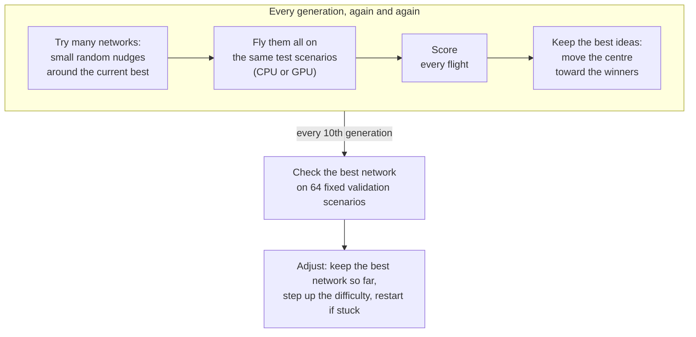

# How the training works

Nobody tells these networks how to fly. They learn the way a gardener breeds better roses: grow many slightly
different plants, keep the ones that bloom best, and grow the next batch from them. Each batch is a **generation**.
After a few hundred generations, a ball that tumbled off its pad flies straight to its goal.

These pages explain the ideas behind that, one idea per page, in plain words and pictures. You need no maths. Each page
has a folded **The maths** box at the end for anyone who wants the formulas.

## One generation

With the default settings, one generation is 256 networks, each flying 16 scenarios: 4,096 flights. The scenarios
stay the same for 5 generations, so networks are compared on the same tests.

## The pages

| Page | In one sentence |
|---|---|
| [Evolution strategies](evolution-strategies.md) | How a cloud of nudged copies finds better networks without calculus, and why the tries come in mirrored pairs. |
| [What the network sees and remembers](memory-neurons.md) | The 29 sensor readings, past frames, and memory neurons that let a network carry a note from one decision to the next. |
| [Step size](step-size.md) | How far each new try strays from the current best, and how the decay setting and its floor shrink it. |
| [Training techniques](training-techniques.md) | Head start by imitation, automatic difficulty, restarts, sensor normalisation, self-play and keeping the best network. |
| [Scoring](scoring.md) | How a flight or a battle earns points, and why Validation is the number to watch. |

Read them in this order if you are new: each one leans a little on the one before.

## Words used on every page

- **Network** (or brain): a small neural network. Every 40 ms (by default) it reads 29 numbers about the flight and
  answers with three: throttle, pitch and yaw.
- **Weight**: one adjustable number inside a network. The default network has 1,059 of them. Training means finding
  good values for all of them at once.
- **Scenario**: one test flight setup, such as a goal 4 km away in a 10 m/s wind.
- **Star**: the best-scoring network of the current generation. **Fly 1** and **Fly 5** replay it.
- **Guidance algorithm**: the hand-written autopilot in the app. It flies the runner and the algorithm sides, and is
  the teacher for the head start.

## More

- [Training guide](../TRAINING.md): every setting, its default and its command-line flag.
- [Architecture](../ARCHITECTURE.md): how the code fits together.
- Interactive pages on memory: [memory-neurons.html](../memory-neurons.html) and
  [brain-memory.html](../brain-memory.html). GitHub shows their source; download them and open them in a browser.
