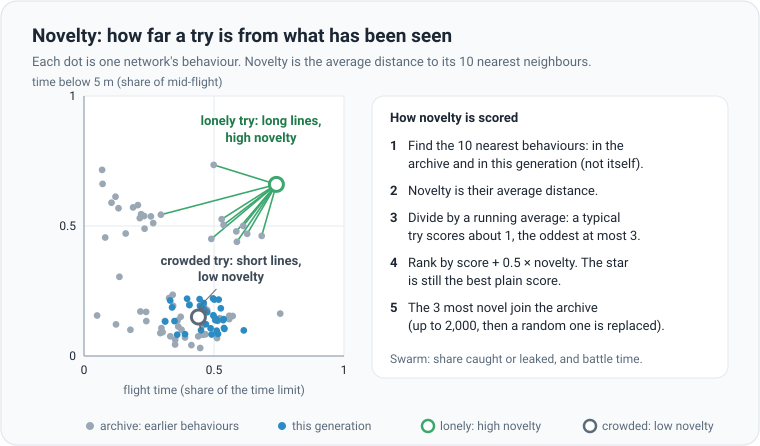
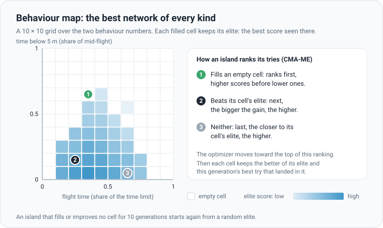

# Diversity search: rewarding the new, not only the best

## The idea

Picture a search for the highest point of a hilly island, in thick fog, with one rule: every step must go uphill. You
will reach a top: the top of whichever hill you started on. The real mountain may stand beyond a valley, and the rule
forbids the first downhill step that leads there.

An [evolution strategy](evolution-strategies.md) follows that rule in spirit. Each generation moves toward the tries
that score best right now. Mostly that works. But a population can settle on one way of flying, such as skimming low
over the ground, and polish it for ever, while a different way that would score more in the end is never tried: its
first versions score worse, so they are never kept.

The cure sounds odd: sometimes reward being **different**, not only being better. A try that does something new is a
stepping stone, even when it scores worse today. The four options on this page do that in four ways. They sit under
**Diversity** in the **Techniques** section of the panel, and all are off by default.

## Behaviour: what a network does, in two numbers

To tell "new" from "more of the same", each network gets a **behaviour**: two numbers between 0 and 1 that describe
*how* it flies, not how well. Two networks with very different weights can fly alike; what counts is what they do.

| Mode | First number | Second number |
|---|---|---|
| Reach, Intercept | flight time, as a share of the time limit (120 s with the default settings) | share of mid-flight spent below 5 m |
| Swarm, defenders | share of attackers caught | battle time, as a share of the time limit |
| Swarm, attackers | share of attackers that got through | battle time, as a share of the time limit |

Both are averages over the generation's scenarios, worked out from results the flights already return, so measuring
behaviour costs no extra flights. Every network becomes a dot on a square: that square is the **behaviour space**.

None of the options changes what counts as good. The star is still the try with the best plain score, and the kept
network is still the best validated one. They change only where the search looks next.

## Novelty bonus

A talent show that gives extra points for an act nobody has seen before. **Novelty** measures how far a try's
behaviour is from what has been seen: its average distance to its 10 nearest neighbours. Neighbours come from this
generation and from an **archive** of earlier behaviours.

The optimizer then ranks every try by **score + 0.5 × novelty**. Novelty is scaled so that a typical try scores about
1 and the oddest at most 3. With the default weight, the bonus is about 0.5 for a typical try and at most 1.5. In Reach
and Intercept a hit is worth 5, so novelty nudges the search without outbidding a hit. In Swarm a catch (for attackers,
a leak) is worth 5 divided by the number of attackers, 1.25 with the default 4, so the same weight counts for more, the
more so with many attackers: start lower there, around 0.1–0.2. Each generation the 3 most novel tries join the
archive. It keeps up to 2,000; after that, a newcomer replaces a random one.

- **When to switch it on**: validation has stalled and the star's flights all look alike, or one trick keeps winning.
  Raise the weight to explore harder; lower it, or switch it off, to polish what was found.
- **In the app**: **Novelty bonus**, with **Novelty weight** (0.1–2, default 0.5). Reach, Intercept and Swarm (each AI
  side keeps its own archive). Command line: `--novelty`, and `--novelty-w X` for the weight (0–5).
- Below the chart, **Behaviours** plots this generation's networks as dots in the behaviour space, the star in amber: a
  spread-out cloud means the population is trying different ways. A status line shows the archive's size.

The maths

With $b(x)$ the behaviour of try $x$ and $b_{(1)}, \dots, b_{(10)}$ its 10 nearest neighbours among the archive and
this generation (itself excluded), raw novelty is

$$
\nu(x) = \frac{1}{10} \sum_{j=1}^{10} \lVert b(x) - b_{(j)} \rVert
$$

A running mean $\bar\nu$ of each generation's average raw novelty sets the scale. The bonus, with weight $w$, is added
to the score $f$:

$$
\bar\nu \leftarrow 0.9\,\bar\nu + 0.1 \operatorname{mean}_x \nu(x), \qquad N(x) = \min\left(3, \frac{\nu(x)}{\max(0.01, \bar\nu)}\right)
$$

$$
f'(x) = f(x) + w\,N(x)
$$

The first generation sets $\bar\nu$ to its own mean. With more than 1,024 tries, each is compared with the archive and
an evenly spaced sample of 1,024 of them, which keeps the work in check.

## Novelty islands

A mining company sends some prospectors to new valleys while the rest keep digging the richest seam, and they share
what they find. **Novelty islands** (from a method called NSR-ES, novelty search with reward) do this with
[islands](evolution-strategies.md#in-the-app). Every other island ranks its tries by the average of two places: its
place by score and its place by novelty. The others rank by score alone.

Migration works as before: every 10 generations by default (**Migrate every**) each island passes its best-scoring
network to the next one in the ring. With an even number of islands, explorers and miners alternate, so every explorer
hands its finds to a miner, and every miner hands its best to an explorer. With an odd number, the last island and the
first are both score islands, side by side.

- **When to switch it on**: you already use islands and want exploration without giving up the score-seekers. Half
  the islands keep their old ranking, so it is a gentle way to start.
- **In the app**: **Novelty islands**. Reach and Intercept, with islands on (it does nothing without them). It uses the
  same archive as the novelty bonus; with both on, "score" includes the bonus. Command line: `--nsr` with
  `--islands N`.

The maths

On a novelty island, let $r_f(x)$ be try $x$'s place when the island's tries are sorted by score and $r_N(x)$ its place
when sorted by novelty (0 is the best). The island ranks its tries by

$$
\frac{r_f(x) + r_N(x)}{2}
$$

smallest first. Islands 2, 4, 6 and so on are novelty islands.

## Behaviour map

Boxing has weight classes, so a great lightweight is not lost behind the heavyweights. The **behaviour map** splits
the behaviour space into a 10 × 10 grid: 100 classes of flight. Each cell keeps its **elite**: the best-scoring network
whose behaviour has landed there. This method is called MAP-Elites.

While the map is on, the islands search for ways to **improve the map** (a method called CMA-ME). Each island ranks its
tries:

1. A try that lands in an empty cell comes first, higher scores before lower ones.
2. Then a try that beats the elite of its cell, the bigger the gain the higher.
3. Then the rest, the closer to their cell's elite the higher.

Then each cell keeps the better of its elite and this generation's best try that landed in it. An island that has
filled or improved no cell for 10 generations in a row starts again from a random elite, with step size 0.05 (genetic
algorithm: 0.03). So the search keeps spreading into new classes of flight, and keeps sharpening the old ones.

- **When to switch it on**: to see the range of ways a network can fly, and to find stepping stones that restarts do
  not reach. The top score may climb more slowly, since the search is spread over many cells.
- **In the app**: **Behaviour map**. Reach and Intercept, with or without islands (without them, the whole population
  is one island), with CMA-ES or the genetic algorithm. Command line: `--map-elites`.
- Below the chart, the **Behaviour map** panel draws the grid: each filled cell coloured by its elite's score, with this
  generation's networks as dots and the star in amber.
- When the map is on, it alone decides the ranking: the novelty bonus and novelty islands still fill the archive but do
  not change the order.
- Elites live in memory only and are never saved. The map starts empty again after a reset, a change of mode, a
  settings change that rebuilds the search (network shape, population, islands, optimizer) and when
  [automatic difficulty](training-techniques.md#automatic-difficulty) steps up a level, since scores from an easier
  level do not compare. A [restart when stuck](training-techniques.md#restarts-when-stuck) keeps it.

The maths

A behaviour $b = (b_1, b_2)$ falls in the cell in column $\min(9, \lfloor 10\, b_1 \rfloor)$ and row
$\min(9, \lfloor 10\, b_2 \rfloor)$. With $f(x)$ the score of try $x$ and $e_c$ the elite score of its cell $c$, the
island sorts its tries tier by tier, and within a tier by a value, highest first:

| Tier | Try $x$ in cell $c$ | Sorted by |
|---|---|---|
| 1 | $c$ is empty | $f(x)$ |
| 2 | $f(x) > e_c$ | $f(x) - e_c$ |
| 3 | otherwise | $f(x) - e_c$ |

The tiers use the map as it was before the generation. Afterwards each cell keeps the best score seen there:

$$
e_c \leftarrow \max\left(e_c, \max_{x \in c} f(x)\right)
$$

## Exploiters

A boxer's sparring partner does not try to be the best boxer in the gym. He studies one fighter and drills that
fighter's weak spot, again and again, until the fighter learns to cover it. **Exploiters** bring that to Swarm
self-play, as AlphaStar did for StarCraft.

When networks fly both sides, each side normally trains against a [pool](training-techniques.md#self-play-opponents) of
the other side's recent stars. With exploiters on, each side also trains a small extra population, a quarter of its own
size (at least 8 networks; 32 with the default population of 256). Its only opponent is the other side's **current
star**.

Every 5 generations, the exploiter's best joins its own side's pool next to the side's star. The other side now meets it
too, and since it is picked more often the more it wins against them, the other side must learn to beat it. The
exploiter starts again from its own side's current star, to look for the next weak spot, once its success against the
star reaches 70% (the share of attackers caught, or for attackers the share that get through; a running average, after
at least 5 generations), or after 100 generations.

- **When to switch it on**: networks on both sides, and one side's star keeps a weakness the other side does not find,
  or the two sides go round in circles, each beating the last trick of the other.
- **In the app**: **Exploiters**. Swarm with networks on both sides only. Command line: `--exploiters`. A status line
  shows each exploiter's success against the other side's star, and how many times they have started again.
- It costs about a quarter more battles per generation, and they are close fights that last longer, so a generation
  takes roughly 1.3 to 1.6 times as long. The speed figure includes them. The pool still holds 16, so it now spans
  about half as many generations of stars.

The maths

A side with population $\lambda$ gets an exploiter of $\lfloor \lambda / 4 \rfloor$ networks, rounded up to an even
number and at least 8, started from the side's star with step size 0.05. Its success $x$ against the other star is the
share of attackers it catches (defenders) or gets through (attackers), over all its networks and battles, $\hat x$,
smoothed after its first generation:

$$
x \leftarrow 0.7\, x + 0.3\, \hat x
$$

Every 5 generations it is reset when $x \ge 0.7$ (after at least 5 generations) or when it has run 100 generations. A
new pool member starts at a success rate of 50%, as every pool member does.

## Choosing

| Option | Modes | Command line | Good for |
|---|---|---|---|
| Novelty bonus | Reach, Intercept, Swarm | `--novelty`, `--novelty-w X` | breaking out of one habit |
| Novelty islands | Reach, Intercept, islands on | `--nsr` | exploring while half the islands keep chasing score |
| Behaviour map | Reach, Intercept | `--map-elites` | many different good flights, and stepping stones |
| Exploiters | Swarm, networks on both sides | `--exploiters` | finding and fixing the stars' weak spots |

- All four are off by default. With all of them off, training is exactly as without them.
- Each can be switched on or off while training; the change applies from the next generation. Switching one off
  forgets what it collected: the map, the exploiters, or the archive once neither novelty option is on. Reset or a
  change of mode forgets everything. A settings change that rebuilds the search forgets the archive and the map (in
  Swarm, a rebuilt side forgets its archive and exploiter); a restart when stuck keeps them. The archive and the map
  also start over when the flight or battle time limit changes (long ranges with automatic difficulty), because the
  time behaviour is measured as a share of that limit. A level-up always clears the map.
- They change where the search looks, not what is kept. The saved network is still the best validated one, so a
  failed experiment costs time, not your network.
