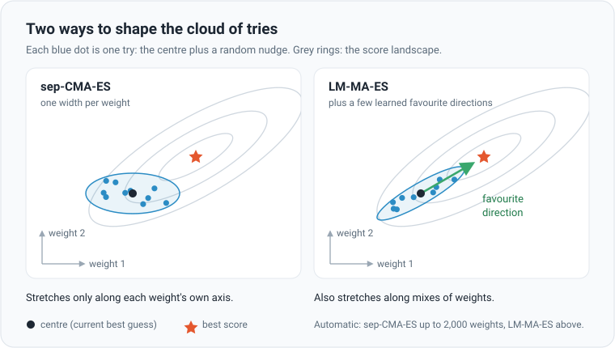
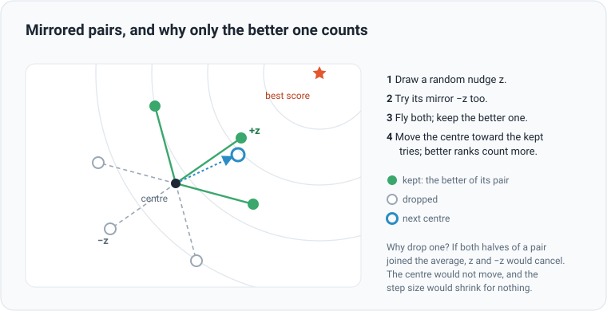

# Evolution strategies: learning without gradients

## The idea

Imagine tuning an old radio with a thousand knobs, blindfolded. You cannot see what any knob does. You can only hear
whether the music got clearer. So you experiment: nudge every knob a little at random, listen, and remember which
nudges helped. Do that with a few hundred nudged copies at once, move toward the ones that sounded best, and repeat.

That is an **evolution strategy**. The knobs are the network's weights: 1,059 of them in the default network.
"Listening" is flying the network on the test scenarios and scoring it.

Most neural networks learn with **gradients** instead: the exact slope of the score for every weight, worked out with
calculus. Here the score comes out of a physics simulation full of yes-or-no moments. The ball hits or misses, lands or
crashes. There is no tidy slope to follow. An evolution strategy needs no slope, only scores. And every try is a
separate flight, which suits a GPU flying thousands of them at once.

## One generation, step by step

1. Start from a **centre**: the current best guess for every weight.
2. Make 256 tries (the **population**). Each is the centre plus a random nudge. How big the nudges are is the
   [step size](step-size.md).
3. Fly every try on the same 16 scenarios. Its score is the average ([scoring](scoring.md)).
4. Move the centre toward the best tries. Better ranks count more: the best counts most, the 128th barely at all.
5. Learn from what worked: stretch the cloud of tries where good steps keep going, shrink it elsewhere.

Step 5 gives **CMA-ES** its name: Covariance Matrix Adaptation, a grand way of saying "learning the shape of the cloud".

## Two ways to shape the cloud

**sep-CMA-ES** gives every weight its own width. Weights whose nudges keep paying off get wider nudges; the others get
narrower ones. It treats each weight on its own ("separable"), so it is cheap: twice the weights, twice the work.

**LM-MA-ES** (limited-memory matrix adaptation) also keeps a few **favourite directions**. Each one is a fading average
of recent winning steps: some remember the last few generations, others much longer. New tries are pulled along these
directions, so the cloud can stretch diagonally, along mixes of weights that work together. A full CMA-ES would track
every pair of weights: over 2 million numbers for a network of 2,083 weights. LM-MA-ES gets much of that benefit from a
few dozen directions.

| Network | Weights | Automatic picks |
|---|---|---|
| Default: 29 inputs, 32 hidden neurons, 3 outputs | 1,059 | sep-CMA-ES |
| Past frames K = 1 | 1,987 | sep-CMA-ES |
| Memory neurons on | 2,083 | LM-MA-ES, 26 directions |
| Two hidden layers of 32 | 2,115 | LM-MA-ES, 26 directions |
| Swarm commander, 4 vs 4, defending | 2,988 | LM-MA-ES, 28 directions |

## Mirrored pairs

Every random nudge is tried twice: forwards (centre + z) and backwards (centre − z). It is like testing a knob both
clockwise and anticlockwise before deciding. The cloud of tries stays perfectly balanced around the centre, so a
lopsided random draw cannot drag the centre off course, and each nudge is judged against its own opposite.

Then a small rule with a big effect, **pairwise selection**: only the better half of each pair may join the average.
With noisy scores, both halves of a pair can land among the winners by luck. Averaged together, z and −z cancel, so the
centre does not move. Worse, the step-size control reads that as "steps that go nowhere" and shrinks the steps for no
good reason. Keeping one per pair stops this slow, silent shrinking. So 256 tries make 128 pairs, and the 128 pair
winners shape the next centre.

## In the app

- **Training → CMA-ES** (default) or **Genetic**. **Techniques → CMA-ES variant**: Automatic (sep-CMA-ES up to 2,000
  weights, LM-MA-ES above), sep-CMA-ES or LM-MA-ES. Command line: `--opt cma|sep|lm|ga`.
- **Population**: 256 by default; auto-tune sets 512 for CMA-ES when islands are off. More tries make each step surer,
  but each generation slower.
- **Islands** (off by default): several smaller populations side by side. Every 10 generations each passes its best
  network to the next island in a ring, whose centre moves half-way toward it.
- Swarm always uses CMA-ES: one for each side a network flies.
- The **genetic algorithm** is the simpler option. It keeps the best eighth unchanged and breeds the rest from parents
  in the top third: each weight comes from one parent or the other, and 30% of them get a random nudge. It learns no
  cloud shape, so it relies on [decay](step-size.md) to fine-tune.

The maths

$n$ weights, population $\lambda$, centre $m$, step size $\sigma$. The tries come in mirrored pairs:

$$
x_k = m + \sigma\, y_k, \qquad y_k = \sqrt{v} \odot z_k, \qquad z_k \sim \mathcal{N}(0, I), \qquad z_{2j+1} = -z_{2j}
$$

$v$ holds one variance per weight (sep-CMA-ES). Pairwise selection keeps the better try of each pair; the $\mu = \lambda/2$
kept tries are ranked $1{:}\lambda, \dots, \mu{:}\lambda$ and weighted

$$
w_i \propto \ln\left(\mu + \tfrac12\right) - \ln i, \qquad \sum_i w_i = 1
$$

$$
m \leftarrow m + \sigma \sum_{i=1}^{\mu} w_i\, y_{i:\lambda}
$$

Step-size control (cumulative step-size adaptation), with $\bar z = \sum_i w_i z_{i:\lambda}$ and $\chi_n$ the expected
length of a random step in $n$ dimensions:

$$
p_\sigma \leftarrow (1 - c_\sigma)\, p_\sigma + \sqrt{c_\sigma (2 - c_\sigma)\, \mu_{\text{eff}}}\; \bar z,
\qquad
\sigma \leftarrow \min\left(2,\ \sigma \exp\left(\frac{c_\sigma}{d_\sigma}\left(\frac{\lVert p_\sigma \rVert}{\chi_n} - 1\right)\right)\right)
$$

Per-weight variances, with the usual CMA-ES rates $c_1, c_\mu$ multiplied by $(n + 2)/3$ as in sep-CMA-ES:

$$
v_i \leftarrow (1 - c_1 - c_\mu)\, v_i + c_1\, p_{c,i}^2 + c_\mu \sum_{k=1}^{\mu} w_k\, y_{k:\lambda,\,i}^2
$$

LM-MA-ES replaces $\sqrt{v} \odot z$ with $d$, built from $z$ by pulling it toward each of $q = 4 + \lfloor 3 \ln n \rfloor$
direction vectors $M_j$ in turn, and learns those directions from $\bar z$:

$$
d \leftarrow (1 - a_j)\, d + a_j\, (M_j^{\top} d)\, M_j, \qquad a_j = \frac{1}{1.5^{j}\, n}, \qquad j = 0, \dots, q - 1
$$

$$
M_j \leftarrow (1 - b_j)\, M_j + \sqrt{\mu_{\text{eff}}\, b_j (2 - b_j)}\; \bar z, \qquad b_j = \min\left(1, \frac{\lambda}{4^{j}\, n}\right)
$$

Its step size uses $\sigma \leftarrow \min\left(2, \sigma \exp\left(\tfrac{c_\sigma}{2}\left(\lVert p_\sigma \rVert^2 / n - 1\right)\right)\right)$
with $c_\sigma = \min(0.5, 2\lambda / n)$. The code also keeps CMA-ES's usual stall guard on $p_c$, left out here.

