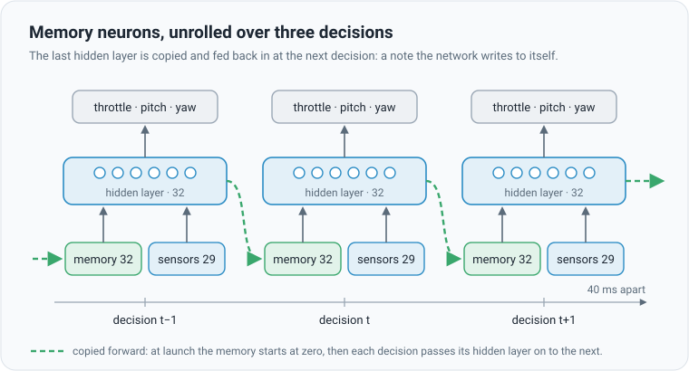

# What the network sees and remembers

## The idea

The network is a pilot flying by instruments, with no window. Every 40 ms (by default) it reads 29 numbers about the
flight and answers with three: **throttle**, **pitch** and **yaw**. It has no other view of the world.

A single glance at the instruments is often enough. But not always. A noisy radar lies a little on every reading. A
delayed one shows where the runner *was*. And a weaving runner only reveals its weave over several glances. For that,
the network needs some memory. It can get it in two ways: **past frames** and **memory neurons**.

## The 29 sensor readings

Everything is measured from the ball's own point of view ("left, right, up" as the ball feels them) and scaled to
small numbers: distances divided by 3 km, speeds by 300 m/s.

| Group | Numbers | What they say |
|---|---|---|
| Where the target is | 7 | its position relative to the ball (3), the direction to it (3), how far (1, on a log scale) |
| How the ball moves | 10 | its velocity (3), its spin (3), which way is up (3), its height (1) |
| How the target moves | 7 | its velocity (3), the closing speed (1), how fast the line of sight turns (3) |
| Where they would miss | 5 | time to go (1), the direction of the predicted miss if nobody steers (3), its size (1, log scale) |

In Reach the target is the fixed goal, so its velocity is zero. In Intercept it is the runner, as the sensors report
it: possibly late (sensor delay) and noisy (sensor noise).

## Past frames: a flipbook

With **past frames** (K = 1 to 4), the network also sees its last K sets of readings, side by side with the current
one. Like a flipbook, a few pages are enough to see motion. K = 2 shows the last 80 ms. The window is fixed: anything
older is gone. Each frame adds 29 inputs.

## Memory neurons: a note to self

With **memory neurons**, the network writes itself a note. At each decision, the values of its last hidden layer are
saved and fed back in as extra inputs at the next decision. The network learns what to put in the note. It could keep a
running average of a noisy reading, or the phase of a weave, for as long as it is useful.

"Unrolled" means drawing the same network once per decision, so the loop becomes a chain. Read the chain left to
right: what the network thought at decision t−1 is part of what it sees at decision t. At launch the note is blank
(all zeros), and so are the past frames.

Memory is harder to learn than past frames. A note is only useful if the next decision learns to read it, so both ends
must improve together. Two details help: in a new random network the memory weights start five times smaller, and the
[head start](training-techniques.md#head-start-by-imitation) sets them to zero, because the guidance algorithm it copies
has no memory. Evolution then switches the note on only where it pays.

## In the app

- **Network → Past frames** (off by default; 0–4) and **Memory neurons** (off by default). Command line: `--K N`,
  `--mem 0|1`.
- Inputs = 29 × (K + 1), plus the memory: as many values as **Neurons per layer** (32 by default). With memory on, the
  default network sees 29 + 32 = 61 inputs.
- Either change alters the network's shape, so training starts a new network; the saved one is kept as a `.bak` file.
- They grow the network too. Memory neurons on the default network make 2,083 weights, over the 2,000 line where the
  [optimizer](evolution-strategies.md) switches to LM-MA-ES.
- Reach and Intercept only. Swarm networks have neither: each ball already sees its neighbours at every decision.
- Tip: try K = 1 or 2 first. Turn on memory neurons when the task needs a longer history, such as heavy noise or a
  weaving runner.

Two interactive pages let you play with these ideas: [memory-neurons.html](../memory-neurons.html) and
[brain-memory.html](../brain-memory.html). GitHub shows their source; download them and open them in a browser.

The maths

At decision $t$ the network reads $s_t$ (29 numbers), the past frames $s_{t-1}, \dots, s_{t-K}$ and, with memory on, the
last hidden layer $h^{(L)}_{t-1}$ of the previous decision. Every layer uses $\tanh$:

$$
h^{(1)}_t = \tanh\left(W\,[\,s_t, s_{t-1}, \dots, s_{t-K}\,] + U\, h^{(L)}_{t-1} + b_1\right)
$$

$$
h^{(\ell)}_t = \tanh\left(W_\ell\, h^{(\ell-1)}_t + b_\ell\right), \qquad \ell = 2, \dots, L
$$

$$
u_t = \tanh\left(V\, h^{(L)}_t + c\right), \qquad \text{throttle} = \frac{u_{t,1} + 1}{2}, \quad \text{pitch} = u_{t,2}, \quad \text{yaw} = u_{t,3}
$$

with $h^{(L)}_{0} = 0$ and the past frames zero at launch. Unrolled, $u_t$ depends on every earlier reading through the
chain $h^{(L)}_{t-1}, h^{(L)}_{t-2}, \dots$, while past frames see exactly $K$ steps back. The weight count is

$$
N = \bigl(29(K+1) + m\bigr)\,w + w + (L - 1)(w^2 + w) + 3w + 3
$$

for $L$ hidden layers of $w$ neurons and memory size $m$ ($m = w$ with memory on, else 0).

