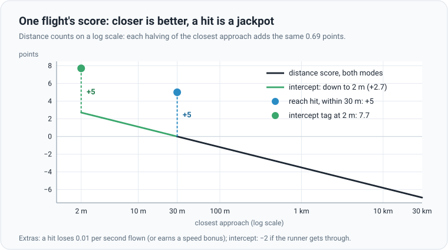

# Scoring: how a flight earns points

## The idea

Scoring works like darts. Closer is better, and the bullseye pays a big bonus. The twist is that distance counts on a
**log scale**: every halving of the closest approach earns the same 0.69 points. Going from 3 km to 1.5 km is worth
exactly as much as going from 60 m to 30 m. So a ball that is far off still gains by getting a little closer, and a
ball that is nearly there still gains by getting closer still.

## Reach target

- **Distance**: 0 points at 30 m, −2.3 at 300 m, −4.6 at 3 km, −6.9 at 30 km.
- **Hit** (within 30 m of the goal): +5. A hit also pays a small time cost, 0.01 per second of flight. With **Reward
  speed** on, it earns a speed bonus instead: the speed weight (3 by default) times the share of a minute it saved, so
  a 20 s flight earns two thirds of the weight.
- **Reward staying above 5 m** (optional): up to +0.5. It looks at mid-flight, from 3 s after launch until 300 m from
  the goal. Full bonus if at most 20% of it is below 5 m, nothing if half or more is.

## Intercept

- **Distance**: the same, but it keeps counting below 30 m, down to the catch distance (2 m, or the blast radius when
  that is larger). Closing from 30 m to 2 m earns up to 2.7 more points.
- **Tag**: +5, with the same time cost or speed bonus.
- **Runner got through** (a miss, and the runner reaches its defended point): −2.
- A chase is a single pass: once the gap starts widening after the chaser has closed in, the flight ends.

A network's score is the average over this generation's scenarios: 16 by default, renewed every 5 generations so
networks are compared on the same tests. **Best fitness** in the panel is the star's score.

## Swarm

A battle has a score for each side. It is divided by the ball counts, so a 3 vs 3 battle compares with a 20 vs 20 one.

- **Defenders**: +5 per catch and −5 per leak, divided by the number of attackers. Plus half the defenders' average
  closeness: each defender's distance score for its closest approach to any attacker.
- **Attackers**: +5 per leak and −2 per attacker caught, divided by the number of attackers. Plus half the attackers'
  average closeness to the defended point (counting stops at 30 m, where an attacker leaks).

For example, in a 4 vs 4 battle where the defenders catch 3 attackers and 1 leaks: the defenders get 5 × (3 − 1) / 4 =
+2.5, and the attackers (5 × 1 − 2 × 3) / 4 = −0.25, each plus their closeness.

## Validation: the honest exam

Training scores are a noisy, moving target. The scenarios change every 5 generations. And the star is the best of 256
networks on this generation's tests, so it is often just the luckiest: like the highest of 256 dice rolls.

**Validation** is the exam it never practised for. Every 10 generations the star flies a fixed set of 64 scenarios it
never trains on. The set is built the same way every time, so the result compares fairly from one check to the next.
It counts **hits**, not points: the share of the 64 flights that reach the goal or tag the runner.

- **Swarm**: each side a network flies meets the guidance algorithm on 64 fixed battles. Defenders report the share of
  attackers they catch; attackers the share that leak.
- New settings that change the scenarios build a new set, so scores before and after do not compare. With
  [automatic difficulty](training-techniques.md#automatic-difficulty) on, validation uses the current level.
- Validation decides which network is [kept and saved](training-techniques.md#keeping-the-best-network), when the
  difficulty steps up, and when training counts as stuck.
- Intercept: `brtrain --ceiling --mode tag ...` measures how often the guidance algorithm, with perfect sensors, tags
  on your settings. Some setups cannot be won, so this is a practical ceiling for validation.

The maths

**One flight** (Reach and Intercept). $d$ is the closest approach in metres, $r$ the floor (30 m in Reach, the catch
distance $\max(2, \text{blast})$ in Intercept) and $t$ the flight time in seconds:

$$
f = -\ln\frac{\max(d, r)}{30} + b
$$

The bonus $b$ is $5 - 0.01\,t$ for a hit, $5 + w \max(0, 1 - t/60)$ for a hit with the speed reward (weight $w$), $-2$
for an Intercept miss when the runner reached its point, and 0 otherwise. Halving $d$ adds $\ln 2 \approx 0.69$.

**Altitude reward.** With $q$ the share of mid-flight steps below 5 m:

$$
f_{\text{alt}} = 0.5 \cdot \min\left(1, \max\left(0, \frac{0.5 - q}{0.3}\right)\right)
$$

**One battle.** $A$ attackers, $D$ defenders, $c$ catches, $l$ leaks. The closeness $C$ adds up $-\ln(\max(d, r)/30)$
over a side's balls, with every $d$ capped at 30 km. Defenders use their closest approach to an attacker and $r$ the
catch distance; attackers use their closest approach to the defended point and $r$ = 30 m.

$$
f_{\text{def}} = \frac{5c - 5l}{A} + \frac{0.5\, C_{\text{def}}}{D}
\qquad
f_{\text{att}} = \frac{5l - 2c}{A} + \frac{0.5\, C_{\text{att}}}{A}
$$

**Validation** is the hit rate $\frac{\text{hits}}{64}$ (Swarm: $\frac{c}{64A}$ for defenders, $\frac{l}{64A}$ for
attackers) on a set built from the same random seed every time.

