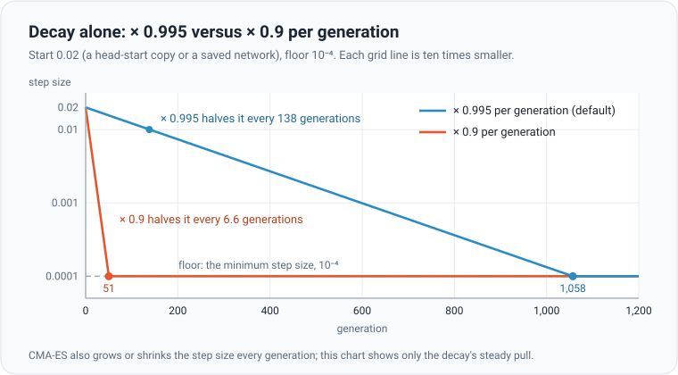

# Step size: how far each try strays

## The idea

The **step size** is how far each new try strays from the current best network. Think of looking for your keys in a
dark room. First you sweep the whole room with big arm movements. Once your fingers touch something, you feel around
in small, careful motions. Big steps explore; small steps fine-tune.

Both extremes hurt. Too big, and every try overshoots the good spots. Too small, and the search crawls, or gets stuck
on the first small bump it finds.

## Three things set it

Every generation, after scoring, the step size is updated in this order:

1. **The optimizer's own control.** CMA-ES watches its recent steps. If they keep pointing the same way, it is making
   steady progress and takes bigger steps. If they zig-zag and cancel out, it is circling a good spot and takes smaller
   ones. (It never lets the step size pass 2.)
2. **Decay** (on by default): multiply by 0.995.
3. **The floor**: never go below the minimum step size, 10⁻⁴ by default.

The control and the decay multiply together. Decay is a steady downward pull; the control pushes back while the
search is still finding real progress.

The chart shows decay alone, from a start of 0.02:

| Generation | × 0.995 | × 0.9 |
|---|---|---|
| 0 | 0.020 | 0.020 |
| 25 | 0.018 | 0.0014 |
| 100 | 0.012 | 0.0001 (floor) |
| 500 | 0.0016 | 0.0001 (floor) |
| 1,000 | 0.00013 | 0.0001 (floor) |

With 0.995, the search has time to explore before it settles. With 0.9, it is at the floor after 51 generations: too
soon to have learned much. To hold the step size level against a 0.9 decay, CMA-ES would have to grow it by 11% every
single generation, which it rarely does. That is why the guide warns that ×0.9 freezes training.

## Where it starts

| Situation | Start (CMA-ES) | Start (genetic) |
|---|---|---|
| A brand-new random network | 0.25 | 0.1 |
| A head-start copy, or a saved or loaded network | 0.02 | 0.03 |
| A wide restart / a fine restart (when stuck) | 0.1 / 0.01 | no restarts |
| Swarm: new / head-start copy / saved network | 0.25 / 0.05 / 0.02 | always CMA-ES |

## In the app

- **Training → Decay step size** (on), **Decay per generation** (0.900–0.999, default 0.995) and **Minimum step size**
  (10⁻⁶ to 0.1, default 10⁻⁴).
- The **Step size** figure in the training panel shows the current value (the average over islands; in Swarm, the
  defenders' when they are a network).
- The floor keeps a little searching alive forever. Set too low, training can stall for good; set too high, it can
  never fine-tune.
- CMA-ES learns a separate width for every weight on top of this one number ([evolution strategies](evolution-strategies.md)).
  The genetic algorithm has only this number, so it depends on decay to fine-tune.
- A [restart](training-techniques.md#restarts-when-stuck) resets the step size when training is stuck.

The maths

With decay $\delta$ and floor $\sigma_{\min}$, one generation of CMA-ES updates the step size as

$$
\sigma \leftarrow \max\left(\sigma_{\min},\ \delta \cdot \min\left(2,\ \sigma\, e^{\,g}\right)\right)
$$

where $e^{\,g}$ is the optimizer's own factor: above 1 when recent steps line up, below 1 when they cancel (see the
maths on the [evolution strategies](evolution-strategies.md) page). Decay alone gives

$$
\sigma_k = \max\left(\sigma_{\min},\ \sigma_0\, \delta^{k}\right)
$$

so it halves every $\ln 2 / (-\ln \delta)$ generations and reaches the floor after $\ln(\sigma_{\min} / \sigma_0) / \ln \delta$:

| $\delta$ | Halves every | Floor from 0.02 | Floor from 0.25 |
|---|---|---|---|
| 0.995 | 138 generations | 1,058 generations | 1,561 generations |
| 0.9 | 6.6 generations | 51 generations | 75 generations |

To hold $\sigma$ level, the optimizer's factor must cancel the decay: $e^{\,g} = 1/\delta$, which is 1.005 for
$\delta = 0.995$ but 1.11 for $\delta = 0.9$.

