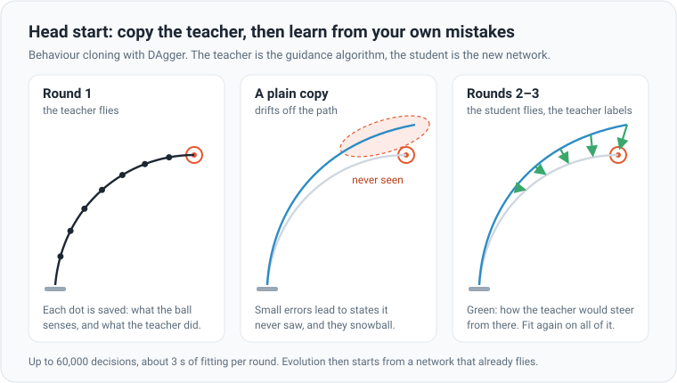
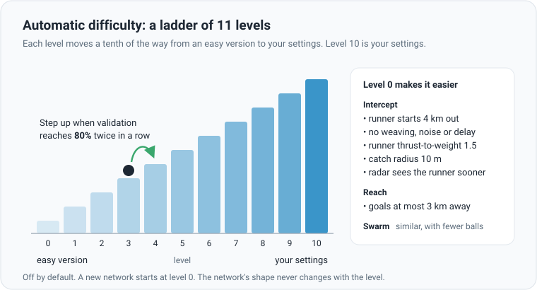
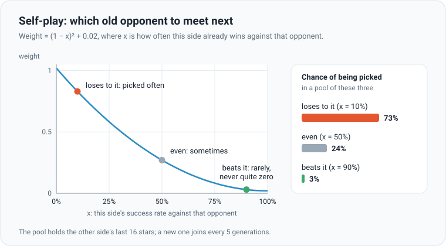

# Training techniques

Six helpers sit around the core [evolution strategy](evolution-strategies.md). Each fixes one way training can go
wrong. The first four are switches in the **Techniques** section of the panel; the last two are always on.

## Head start by imitation

A learner driver does not start by guessing what the pedals do: an instructor shows them first. A brand-new network is
in the same spot. With random weights it crashes for hundreds of generations before evolution finds anything useful.
So a new network first copies a teacher: the app's guidance algorithm, the same autopilot that flies the runner.

In round 1 the teacher flies 64 practice scenarios (Swarm: 48 battles). Every decision is saved as a pair: what the
ball senses, and what the teacher did. The network is then fitted to copy those answers. Here, unlike in evolution,
every decision has a right answer, so ordinary gradient descent works: up to 3 seconds of it per round.

A plain copy has a weakness. It only ever saw the teacher's tidy flights. Its first small mistake takes it somewhere
the teacher never went, where it has no idea what to do, and the errors snowball. So in rounds 2 and 3 the copy flies
itself, and the teacher labels every state it reaches: "from here, I would do this". That fix is called **DAgger**
(dataset aggregation). The copy learns to recover from its own mistakes.

- On by default, for new networks only. Command line: `--no-imitate`.
- Up to 60,000 recorded decisions (15,000 for a Swarm commander), spread over the 3 rounds.
- Evolution then starts from the copy with a small step size: 0.02 (Swarm: 0.05). It can go on to beat its teacher.

## Automatic difficulty

You learn to swim in the shallow end. **Automatic difficulty** starts a new network on an easy version of your
settings and moves it toward the real ones in 10 levels. Level 10 is exactly your settings.

- Off by default. **Step up at validation** sets the bar: 80% by default (30–100%). The network climbs a level each
  time validation reaches it twice in a row. In Swarm, every side a network flies must reach it. Command line:
  `--auto-diff` (always 80%).
- Each level moves a tenth of the way. Level 0 means goals at most 3 km away (Reach); runners or attackers from 4 km
  (Swarm: the farthest at most 6 km); no noise or delay. A network that chases also gets no weaving, a runner
  thrust-to-weight of at most 1.5, a catch radius of at least 10 m, a radar that sees just past the farthest start (if
  the radar is on) and, in Swarm, fewer attackers. Network attackers facing algorithm defenders instead get fewer
  defenders, whose radar sees only 2 km. With networks on both sides, only the shared changes apply. Ball counts
  change only when no commander network depends on them.
- Validation is measured at the current level, so it dips after each step up. The status line shows the level.

## Restarts when stuck

Stuck on a crossword, you either step back and scan the whole grid, or zoom in on one corner. Restarts do both, in
turn. At each validation (every 10 generations) training asks: did validation reach a new best, or did the star's
average score since the last check beat its best by more than 0.05? After 6 checks with neither, and validation still
below 100%, CMA-ES starts again around the [kept network](#keeping-the-best-network):

| Restart | Search | Population | Step size |
|---|---|---|---|
| 1st, 3rd, 5th… | wide | × 2, then × 4, then × 8 at most | 0.1 |
| 2nd, 4th, 6th… | fine | × ½ | 0.01 |

On by default (`--no-restarts`). Reach and Intercept restart only with CMA-ES; Swarm restarts each side on its own.
Taking turns between a big population and a small one comes from a method called BIPOP-CMA-ES.

## Sensor normalisation

You cannot compare prices in yen and euros until you convert them. The 29 sensors are like that: some swing widely,
others barely move. A nudge of the same size to their weights then has wildly different effects, and one step size
cannot suit them all. **Normalise sensors** turns each reading into "how unusual is this?": minus its typical value,
divided by its typical spread.

The typical values come from flying the star on up to 16 of the generation's scenarios: at generation 5 (for an
existing network, after its first generation), then every 50. New figures are blended half-way with the old ones. The
rescaling is folded into the network's first layer, so the saved file is an ordinary network, and the optimizer's
networks are re-expressed so they still fly the same. On by default, Reach and Intercept only (`--no-norm`).

## Self-play opponents

In a chess club you practise most against players who still beat you, and now and then against ones you beat, so you
do not forget how. When networks fly both Swarm sides, each side trains against a pool of the other side's last 16
stars. A new star joins every 5 generations, in place of the oldest.

Each scenario draws one opponent from the pool, weighted toward the ones this side still loses to. This is
**prioritised fictitious self-play** (PFSP). Success means the share of attackers caught (defenders) or leaked
(attackers), kept as a running average. Every network in a generation meets the same opponent on the same scenario, so
their scores stay comparable. Watch the validation rates, not the training scores: those move as the opponents change.

## Keeping the best network

A record book keeps the best time; a bad day does not erase it. At every validation the star (this generation's best)
flies the 64 fixed validation scenarios. It replaces the **kept network** if it scores at least as well. After a
settings change, the kept network is validated again first, so the comparison stays fair. The kept network is the one
that is saved, the one restarts start from, and the one **Save network…** downloads. See [scoring](scoring.md) for
what validation measures.

The maths

**Difficulty.** A setting at level $\ell$ is $e_\ell = e_{\text{easy}} + (e_{\text{yours}} - e_{\text{easy}})\,\ell / 10$.
Noise and delay are $e_{\text{yours}}\,\ell / 10$. Ball counts are $1 + \operatorname{round}\bigl((n - 1)\,\ell / 10\bigr)$.

**Self-play.** Opponent $k$ is drawn with probability

$$
P(k) = \frac{(1 - x_k)^2 + 0.02}{\sum_j \left((1 - x_j)^2 + 0.02\right)}, \qquad x_k \leftarrow 0.8\, x_k + 0.2\, \hat x_k
$$

where $\hat x_k$ is this generation's success rate against $k$. A new pool member starts at $x = 0.5$.

**Normalisation.** With sensor means $\mu_i$ and spreads $\sigma_i$ (at least 0.05), the first layer is folded as
$W'_{ji} = W_{ji} / \sigma_i$ and $b'_j = b_j - \sum_i W_{ji}\, \mu_i / \sigma_i$, so the network sees $(s_i - \mu_i)/\sigma_i$.

**Head start.** The network is fitted by Adam (learning rate $10^{-3}$, batches of 128) to minimise the mean squared
error between its outputs and the teacher's, $\frac{1}{N} \sum \lVert \text{net}(s) - a \rVert^2$.

